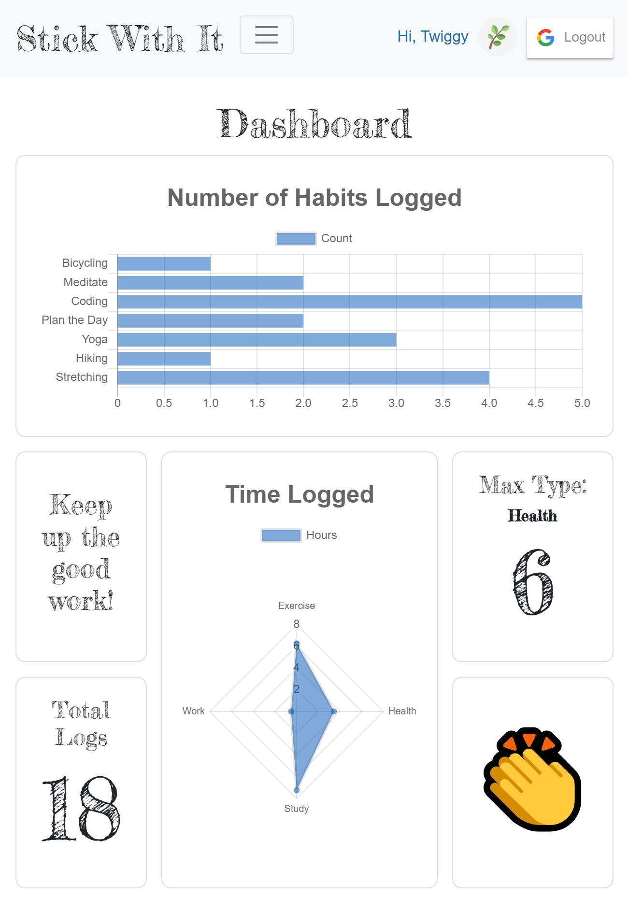

# Stick With It

https://stick-with-it.herokuapp.com/

A simple habit tracking app that will help you build new habits as well as maintain old habits, by displaying your frequency in an easy to digest format. This was built with the MERN stack, using MongoDB and deployed to Heroku.

## Inspired by these quotes:

> "What seems impossible today will one day become your warm-up" - unknown

> "Make it so easy you can’t say no." - Leo Babauta

## Create an Account or try the Demo
Easily create an account by logging in with Google

-OR-

Use this Demo Account to get a feel of the app:
> Username: Twiggytester@gmail.com

> Password: Twigs123

## Preview
